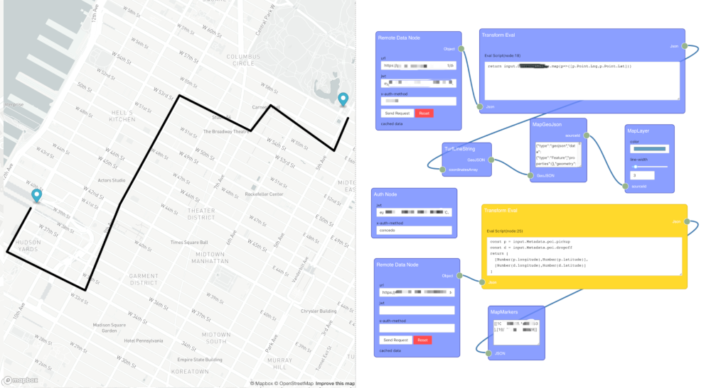

# node-map

Use node editor to control data transform then visualize on the map.



## Start dev

```
$ npm i # --force
$ npm start
```

test production build at local

```
$ npm run build-localhost
```

## Examples

* Simple - https://xx7y7xx.github.io/node-map/?load=https://xx7y7xx.github.io/node-map/examples/simple.json
* World countries - https://xx7y7xx.github.io/node-map/?load=https://xx7y7xx.github.io/node-map/examples/world.json (https://github.com/johan/world.geo.json)

## Docs

* [Nodes](/NODE.md)
* [Develop](/DEVELOP.md)