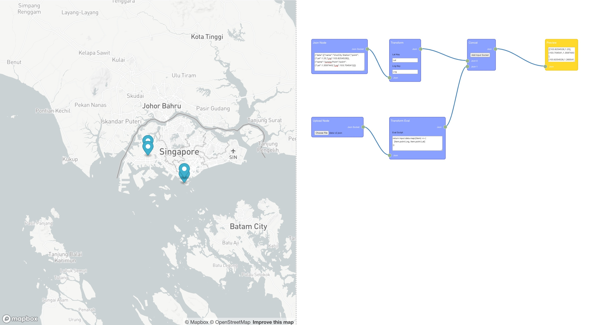

# node-map

Use node editor to control data transform then visualize on the map.



## Start dev

```
$ npm start
```

test production build at local

```
$ npm run build-localhost
```

## Remove react v18 warn

```
$ vim node_modules/react-dom/cjs/react-dom.development.js
```

Search for "ReactDOM.render is no longer supported in React 18", and comment this line.

```
$ mv node_modules/.cache/default-development /tmp
```